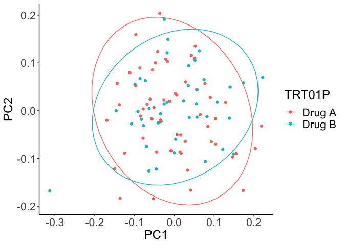
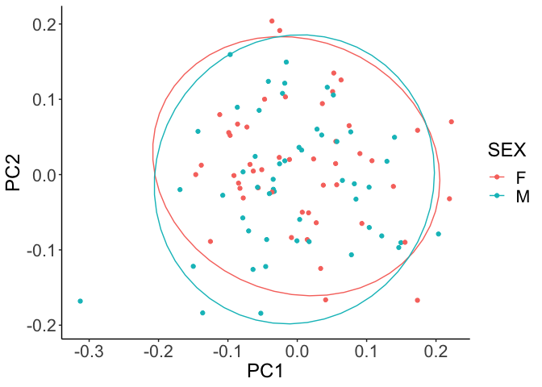

README
================

## Setup

## Introduction

PCA is a dimensionality reduction technique widely used in machine
learning and data visualization. It operates by calculating the
eigenvectors and eigenvalues of the covariance or correlation matrix.
These eigenvectors, also known as principal components, define the
directions in the new feature space that maximize variance. The
eigenvalues, on the other hand, quantify the magnitude of this variance
along each direction. In essence, the eigenvalues explain the variance
of the data along the new feature axes, which are the principal
components.

The eigenvectors of the covariance matrix correspond to the columns in
the projection matrix and are arranged in descending order of their
corresponding eigenvalues. These eigenvalues represent the amount of
variance explained by each eigenvector. The data matrix is then
multiplied by this projection matrix to project the data onto the
feature space defined by the principal components. These principal
components are linear combinations of the variables in the data matrix
and form an orthogonal basis (in statistics, “orthogonal” implies
“uncorrelated”) for this new feature space. The outcome represents the
coordinates of the original data points in this new feature space for
each principal component.

The first principal component is the direction in the data with the most
significant variance. The second principal component, orthogonal to the
first, has the second largest variance. This pattern continues for as
many principal components as there are dimensions in the original data.

So PCA can be utilized for noise reduction (by dropping columns in the
score matrix that explain a small amount of variance), feature
extraction (by referencing which features )

## Data Preparation

``` r
# Create sample dataframe
set.seed(123) # for reproducibility
sample_df <- data.frame(
  USUBJID = rep(sprintf("%03d", 1:100), each = 2), # 100 subjects, each repeated twice
  AGE = rep(rnorm(100, 50, 10), each = 2), # age from a normal distribution, each repeated twice
  SEX = rep(sample(c("M", "F"), 100, replace = TRUE), each = 2), # sex randomly assigned, each repeated twice
  TRT01P = rep(sample(c("Drug A", "Drug B"), 100, replace = TRUE), each = 2), # treatment randomly assigned, each repeated twice
  LBTESTCD = rep(c("AA","Ba"), 100), # two LBTESTCD values for each subject
  AVAL = rnorm(200, 5, 1) # two AVAL measures for each subject
)
head(sample_df)
```

    ##   USUBJID      AGE SEX TRT01P LBTESTCD     AVAL
    ## 1     001 44.39524   F Drug B       AA 7.198810
    ## 2     001 44.39524   F Drug B       Ba 6.312413
    ## 3     002 47.69823   F Drug B       AA 4.734855
    ## 4     002 47.69823   F Drug B       Ba 5.543194
    ## 5     003 65.58708   F Drug A       AA 4.585660
    ## 6     003 65.58708   F Drug A       Ba 4.523753

``` r
plot1 <- pca_pipeline(sample_df,id="USUBJID",group="TRT01P",scale=T)
```

    ## Warning: Using an external vector in selections was deprecated in tidyselect 1.1.0.
    ## ℹ Please use `all_of()` or `any_of()` instead.
    ##   # Was:
    ##   data %>% select(names_col)
    ## 
    ##   # Now:
    ##   data %>% select(all_of(names_col))
    ## 
    ## See <https://tidyselect.r-lib.org/reference/faq-external-vector.html>.
    ## This warning is displayed once every 8 hours.
    ## Call `lifecycle::last_lifecycle_warnings()` to see where this warning was
    ## generated.

    ## Warning: Using an external vector in selections was deprecated in tidyselect 1.1.0.
    ## ℹ Please use `all_of()` or `any_of()` instead.
    ##   # Was:
    ##   data %>% select(values_col)
    ## 
    ##   # Now:
    ##   data %>% select(all_of(values_col))
    ## 
    ## See <https://tidyselect.r-lib.org/reference/faq-external-vector.html>.
    ## This warning is displayed once every 8 hours.
    ## Call `lifecycle::last_lifecycle_warnings()` to see where this warning was
    ## generated.

    ## Warning: Using an external vector in selections was deprecated in tidyselect 1.1.0.
    ## ℹ Please use `all_of()` or `any_of()` instead.
    ##   # Was:
    ##   data %>% select(id)
    ## 
    ##   # Now:
    ##   data %>% select(all_of(id))
    ## 
    ## See <https://tidyselect.r-lib.org/reference/faq-external-vector.html>.
    ## This warning is displayed once every 8 hours.
    ## Call `lifecycle::last_lifecycle_warnings()` to see where this warning was
    ## generated.

    ## Warning: Using an external vector in selections was deprecated in tidyselect 1.1.0.
    ## ℹ Please use `all_of()` or `any_of()` instead.
    ##   # Was:
    ##   data %>% select(group)
    ## 
    ##   # Now:
    ##   data %>% select(all_of(group))
    ## 
    ## See <https://tidyselect.r-lib.org/reference/faq-external-vector.html>.
    ## This warning is displayed once every 8 hours.
    ## Call `lifecycle::last_lifecycle_warnings()` to see where this warning was
    ## generated.

``` r
plot1
```

<!-- -->

``` r
plot2 <- pca_pipeline(sample_df,id="USUBJID",group="SEX",scale=T)
plot2
```

<!-- -->
